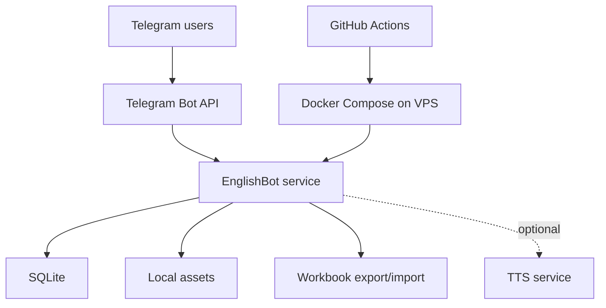

# EnglishBot

EnglishBot is a Telegram-first English learning bot built as a modular Python monolith. It combines learner practice, family-shared content authoring, homework assignment, and offline workbook editing in one process, with SQLite as the runtime source of truth. The project is opinionated about keeping the product small: Telegram is the UI, not a thin notification layer over a larger web system.

## Why I built it

I wanted a learning tool that could live where users already are: Telegram. The interesting engineering problem was not building another flashcard app, but making a chat interface behave like a real application while keeping the system easy to run and reason about.

The repository also reflects a deliberate simplification. An earlier workspace-heavy model was being replaced with a family-first one: shared family content, personal progress, and personal homework. That reduced coordination logic and made the data model fit the actual product better.

Another goal of the repository was to make agent-driven development itself inspectable. The project keeps a documented chain of commands for AI agents, separates agent roles and responsibilities in repo guidance, and serves partly as a practical exercise in learning agent-based "vibe coding" in Python on a real codebase rather than in toy examples.

## Features

- Telegram-first learner flow with `/learn`, `/topics`, `/homework`, `/settings`, and `/me`
- Shared family-owned dictionary and topics
- Teacher-side content editing and homework assignment inside Telegram
- Resumable staged training sessions backed by SQLite
- Offline bulk editing through `.xlsx` export/import
- Optional internal TTS integration for pronunciation playback
- Docker-based deployment with CI test + VPS deploy workflow
- Documented command-chain history for AI-agent-driven development
- Repository guidance that separates AI agent roles and working rules

## Architecture

The bot runs as a single Python service. `aiogram` handles Telegram transport, domain modules hold product logic, and SQLite stores runtime state for content, sessions, homework, media metadata, and caches. Multi-step Telegram flows use `aiogram-dialog`, while workbook import/export provides an escape hatch for bulk editing without adding a separate web admin panel.

Several design choices are pragmatic rather than fashionable:

- SQLite keeps the operational model simple and makes backups, local runs, and migrations straightforward.
- The codebase stays a modular monolith because the hard part here is product flow and state management, not service isolation.
- Workbook import is backup-first and validation-first because bulk edits are high leverage and easy to get wrong.
- TTS is optional and fail-closed so the core bot remains usable without external services.



## Technologies

- Python 3.12
- `aiogram` and `aiogram-dialog`
- SQLite via the standard library
- `openpyxl` for workbook import/export
- `Pillow` for image handling and progress rendering
- Docker Compose and GitHub Actions for deployment

## Running locally

```bash
pip install -r requirements.txt
cp .env.example .env
```

Set `TELEGRAM_BOT_TOKEN` in `.env`.

Optional for a private local setup:

- set `ENGLISHBOT_OWNER_TELEGRAM_USER_ID`

Then run:

```bash
python -m englishbot
```

## What I learned

The most interesting part of the project was treating Telegram as an application surface instead of a message log. That pushed the design toward message reuse, resumable state, compact dialog flows, and strict separation between UI orchestration and business logic.

The other useful lesson was that "simple" operational choices matter. SQLite, local assets, explicit backups, and a plain HTTP status server made the system easier to debug than a more distributed design would have.

It was also useful to see where agent workflows help and where they need structure. Keeping explicit prompts, command history, and role boundaries in the repository turned "vibe coding" from something fuzzy into something that can be reviewed, repeated, and corrected.

## Future ideas

- Keep simplifying older UI screens toward single-message flows
- Improve learner progress reporting beyond session and homework snapshots
- Add more family-first features without reviving the removed workspace model
- Keep tightening the workbook editing path and recovery tooling
