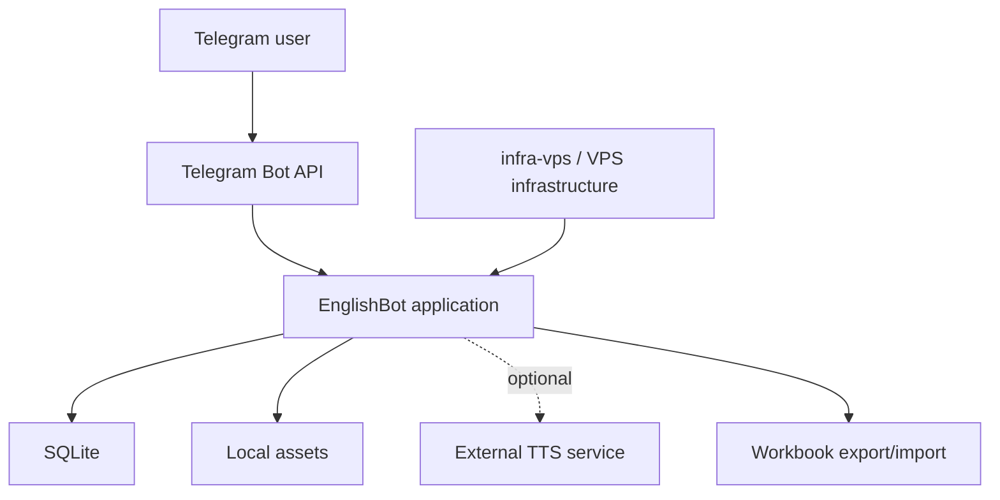

# EnglishBot

EnglishBot is the second version of a Telegram bot for learning English. It is a Python application built around Telegram as the primary UI, with SQLite as the runtime source of truth for content, progress, homework, and media metadata.

## Why this version exists

The first version worked, but too many concerns lived in one place. Application logic, deployment steps, and VPS-specific infrastructure decisions were mixed together in the same bot repository. That was manageable at first, but it made the project harder to reason about and harder to change safely.

This version exists to separate those concerns. The shared VPS layer now lives in a different repository, while this repository focuses on the bot itself: learning flows, content editing, persistence, and Telegram-facing behavior.

It was also a rewrite experiment. A large part of the restructuring was done with an agent-assisted workflow, not to automate judgment away, but to make the rewrite more explicit and easier to review.

## What it does

- Learner practice through `/learn`
- Topic-based learning through `/topics`
- Personal homework flow through `/homework`
- Family-shared learning content and assignments
- Teacher-side content editing inside Telegram
- Offline workbook export/import for bulk content editing
- Optional pronunciation playback through an external TTS service

## Architecture

At a high level, this is still one application process. Telegram is the UI surface, `aiogram` handles bot transport, domain logic stays inside focused Python modules, and SQLite stores runtime state. Bulk editing is intentionally handled through workbook import/export rather than a separate admin app.

The split from the first version is mostly about boundaries:

- this repository contains the EnglishBot application
- shared VPS, reverse proxy, HTTPS, WireGuard, and deployment support live in `infra-vps`
- the bot keeps local runtime data and assets, while deployment wiring stays outside the app code



## Agent-assisted rewrite

The rewrite used a simple three-role workflow:

- `architect` for shaping the direction of the rewrite
- `coder` for implementation
- `complexity guard` for pushing back on unnecessary abstraction and scope growth

The point was not to pretend the agents guarantee correctness. They were used as structured assistants for implementation, review, and iteration. Requests and implementation steps were documented during the rewrite, and that history remains in the repository as part of how the project evolved.

In practice, the most useful part of the setup was the `complexity guard`. It helped keep a personal project from drifting into avoidable architecture and tooling overhead during a large rewrite.

## Tech stack

- Python 3.12
- `aiogram`
- `aiogram-dialog`
- SQLite via the Python standard library
- `openpyxl`
- `Pillow`
- Docker Compose
- GitHub Actions

## Running locally

Minimal local setup appears to be:

```bash
pip install -r requirements.txt
cp .env.example .env
```

Set `TELEGRAM_BOT_TOKEN` in `.env`, then run:

```bash
python -m englishbot
```

Optional local configuration in `.env` includes:

- `ENGLISHBOT_OWNER_TELEGRAM_USER_ID` for owner-managed local access
- `ENGLISHBOT_TTS_BASE_URL` if you want TTS enabled

## Lessons learned

- Separating application code from VPS and deployment concerns makes even a personal project easier to change.
- SQLite is a good fit when the product is one service and operational simplicity matters more than theoretical flexibility.
- Telegram can support richer flows than a command-and-reply bot, but only if UI state is treated carefully.
- Agent-assisted coding is more useful when the roles are explicit and the rewrite history is documented.
- A dedicated “complexity guard” is a practical way to keep a rewrite from becoming an architecture exercise.

## Related repositories

- [`infra-vps`](https://github.com/IavnFGV/infra-vps) contains the shared VPS infrastructure layer: reverse proxy, HTTPS, WireGuard, and deployment support.
- This repository contains the EnglishBot application itself.
