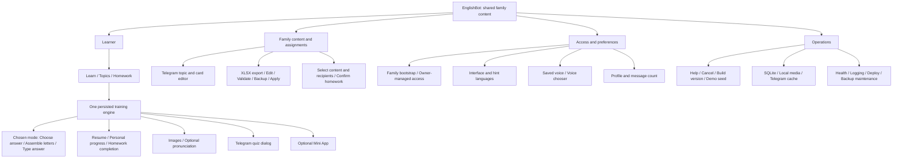
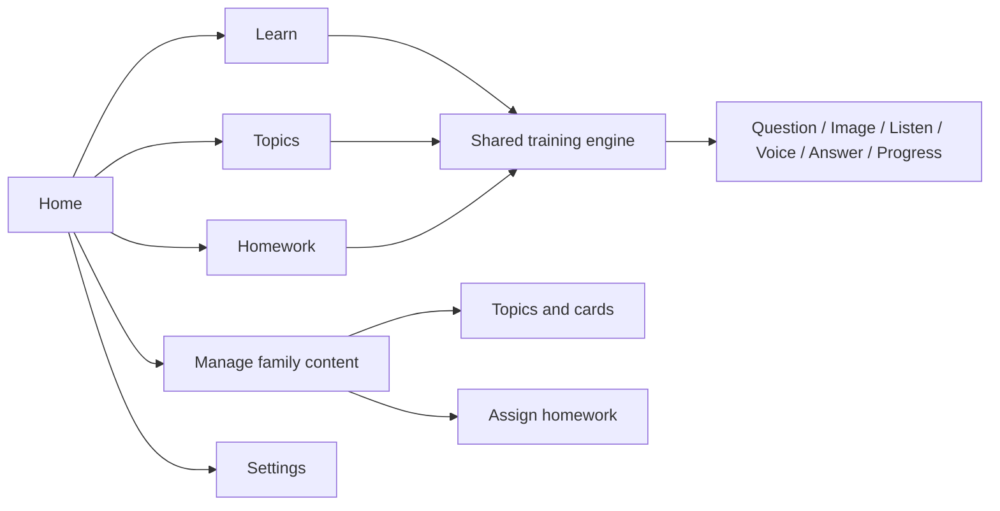

# Functionality Map and Simplification Review

Reviewed and updated on 2026-10-01. Shared training modes are implemented; the remaining simplification suggestions are proposals.
The scope is the active family-first product; no usage analytics were available for this review.

## Current product

The registry defines 14 commands. The default Telegram command menu contains 12;
the owner menu adds `/seed_demo`, and `/add_family` is a technical command outside the menu.
Scope labels in the registry do not establish separate teacher access controls:
active authoring is family-membership based.

| User task | Current entry point | Assessment |
| --- | --- | --- |
| Start and obtain access | `/start`, technical `/add_family` | Essential setup; keep out of everyday learning navigation |
| Practice family cards | `/learn` | Core; selects up to five words: needs-review first, then new, then oldest answered; ties are randomized |
| Select a topic | `/topics` | Core; shares the training engine |
| Complete personal homework | `/homework` | Core; resumable, with progress display and completion |
| Create homework | `/create_assignment` | Core for the assigning family member |
| Edit topics, cards, translations, media | `/teacher_content` | Core authoring; terminology still refers to a teacher |
| Edit content in a spreadsheet | `/bulk_edit` | Second authoring surface; useful for volume, operationally expensive |
| Change languages and voice | `/settings`, quiz voice controls | Languages are useful; voice choice has multiple entry points |
| Inspect account | `/me` | Displays identity, role, and message count; not a learning-progress dashboard |
| Help, exit, inspect build | `/help`, `/cancel`, `/version` | Keep available, but separate from primary learning choices |
| Generate demo content | `/seed_demo` | Owner setup tool |
| Train in a web interface | Optional Mini App | Second learner UI over the same SQLite session |

## Where complexity accumulates

1. **Two learner interfaces.** Telegram and Mini App share domain state, but need
   separate rendering, interactions, media delivery, and interface-specific testing.
   The Mini App also requires authenticated HTTP routes and stale-answer handling.
2. **Two authoring interfaces.** The Telegram editor and XLSX path solve related tasks
   at different scales. Bulk edit adds persisted sessions, reminders, expiry, upload
   retention, backups, asset staging, validation, and atomic apply.
3. **Global bulk-edit gate.** One active spreadsheet session blocks ordinary bot flows
   for other users while the workbook is being edited, not only during database apply.
   Removing this gate safely requires reviewing concurrent edits and session snapshots.
4. **Shared learning rules, now implemented.** Practice, topics, and homework use
   a selected mode with one correct answer per word. Assistance and retry rules are
   shared; the separate homework boost and staged progression paths have been removed.
5. **Pronunciation customization.** Changing voice on the current card is useful when
   the learner hears a bad pronunciation. Keep Listen and Voice together; the voice
   catalog, saved preference, and audio variants are the cost of supporting this.
6. **Navigation without a learning outcome.** Profile message counts, build metadata,
   and setup utilities compete for menu space with learning tasks.

Images, local media persistence, resumable sessions, SQLite, and import safeguards
support existing behavior. They are not first-choice removal targets.
Legacy workspace, publish, invite/join, and topic-grant flows are already absent from
active wiring; they are not a new simplification opportunity in the current UI.

## Proposed cuts, in order

| Priority | Concrete proposal | Expected benefit | Constraint |
| --- | --- | --- | --- |
| 1 | Present Learn, Topics, Homework as primary learner choices; place authoring and preferences behind secondary navigation | Fewer choices at the start | Keep direct commands usable; changing menus alone does not reduce domain code |
| 1 | Remove `/me` from primary navigation; show necessary identity information in settings | Removes a low-value screen | Do not present message count as learning progress |
| 1 | Keep Listen and Voice together on the current card | A learner can react immediately to a bad pronunciation | The extra controls are justified by this task; do not remove them merely to shorten the screen |
| 2 | Choose a primary learner interface and freeze feature expansion on the other | Reduces duplicate UI work | There is no evidence here that either interface is unused |
| 2 | If spreadsheets are the main editing tool, narrow Telegram editing to quick corrections; otherwise make XLSX a maintenance tool | Reduces authoring overlap | Preserve bulk import safeguards while imports remain supported |
| Done | Use one chosen mode for practice and homework, with common retry and help behavior | One explanation and one state transition path | Existing snapshots and current stages are preserved during upgrade |
| 3 | Revisit whole-bot blocking during spreadsheet editing | Other learners can keep using the bot | This is a concurrency change, not a safe middleware deletion |

## Proposed everyday product

## One path for practice and homework

The learner chooses a mode for new `/learn` or topic sessions; homework mode is
chosen by the assigning family member before confirmation. Existing sessions resume
with their saved mode. The same engine implements every entry point:

| Mode | Completion | Help |
| --- | --- | --- |
| Easy | One correct choice per word | Listen and Voice stay available when TTS is enabled |
| Medium | One correct word assembled from letters | Listen and Voice stay available when TTS is enabled |
| Hard | One correctly typed word | Help changes only this word to medium; completing it records assistance |

A wrong answer leaves the word pending and advances to another pending word. After
three wrong answers, the word is deferred for the rest of this round. Session completion
means the round ended; homework completion requires every assigned word to be completed.
Reopening incomplete homework resets deferred-word attempts and preserves completed words.
Summaries distinguish completed, deferred, and assisted words. The wheel fills by completed
words, and there is no assignment-wide streak boost.

Practice selection uses persisted personal progress: words with errors or assistance,
then unseen words, then oldest answered words. Ties are randomized. This is a simple
review queue, not an interval-based memory model. Easy questions use the available family
choices, up to three; a dictionary with one unique word has only one option.

The schema upgrade keeps old prompt/answer snapshots, completed words, and current
card stages. Remaining words use the shared one-answer completion rule. Old homework
and old session mode metadata default to easy; existing card stages stay as saved.
Legacy counter columns remain for storage compatibility, but the old progression logic
has been removed. Interface removal and bulk-edit concurrency remain separate proposals.

## Evidence and limits

- `englishbot/command_registry.py`, `englishbot/bot.py`, and
  `tests/test_command_registry.py`: command inventory, runtime wiring, profile output.
- `englishbot/training.py`, `tests/test_training.py`, `tests/test_exercises.py`, and
  `tests/test_homework.py`: item selection, stages, homework boost, and progress.
- `englishbot/bulk_edit.py` and `tests/test_bulk_edit.py`: one active session and
  blocking of ordinary flows for both the initiator and other users.
- `tests/test_mini_app.py`: shared session, authentication, question versions,
  pronunciation, media access, and cross-interface launches.
- `tests/test_teacher_content.py` and `englishbot/settings_handlers.py`: family
  authoring and saved voice selection.
- `docs/architecture.md`, `context/current-state.md`, and
  `docs/family-first-rebuild.md`: structural context and the four-part product core.

Recommendations express a complexity assessment, not measured user demand.
The original review removed no runtime behavior. The subsequent implementation removed
the separate staged progression paths and homework streak boost; no learning content was deleted.
